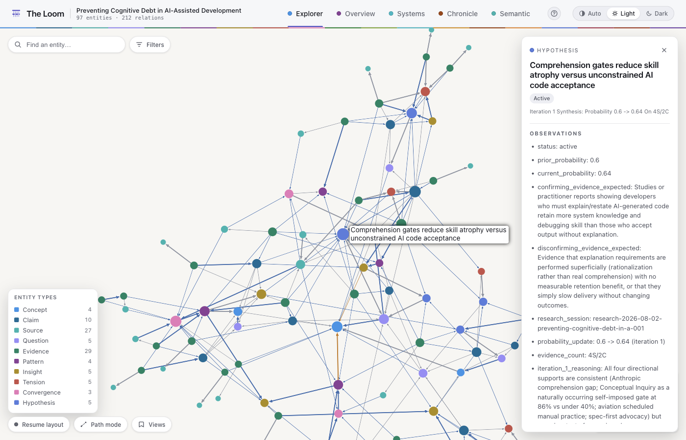
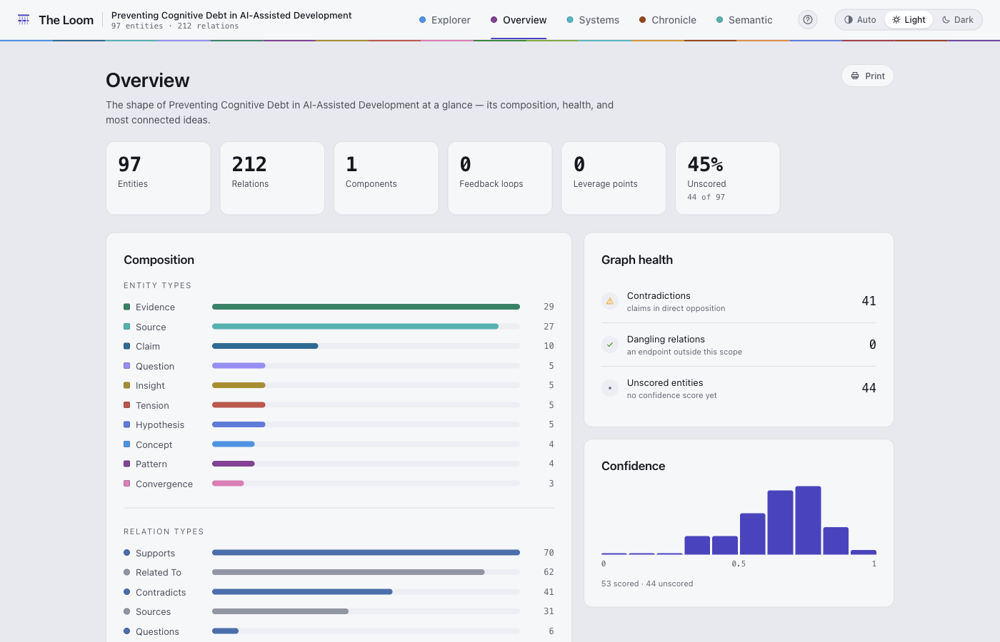
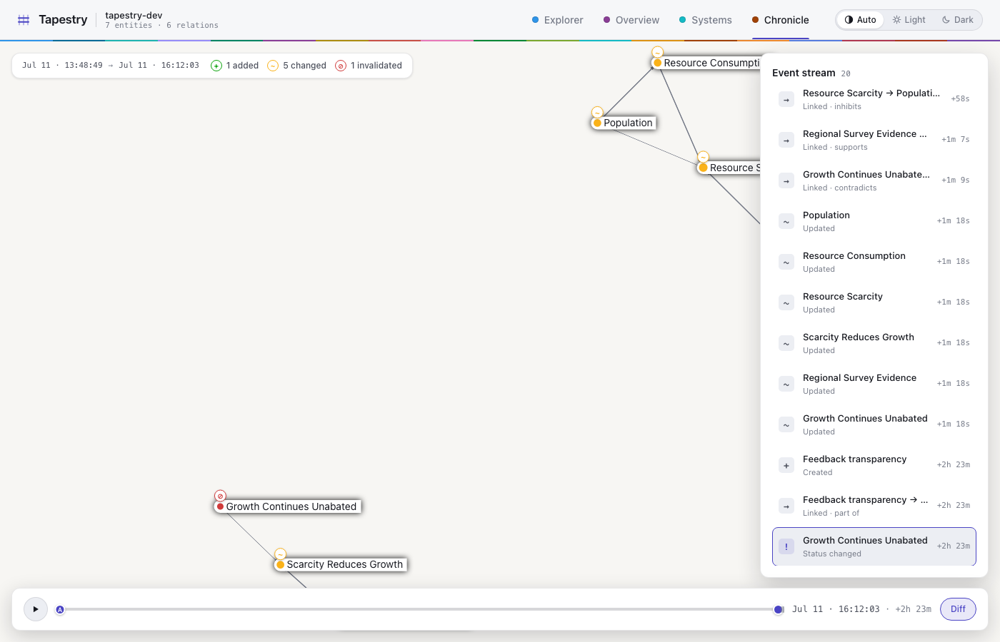
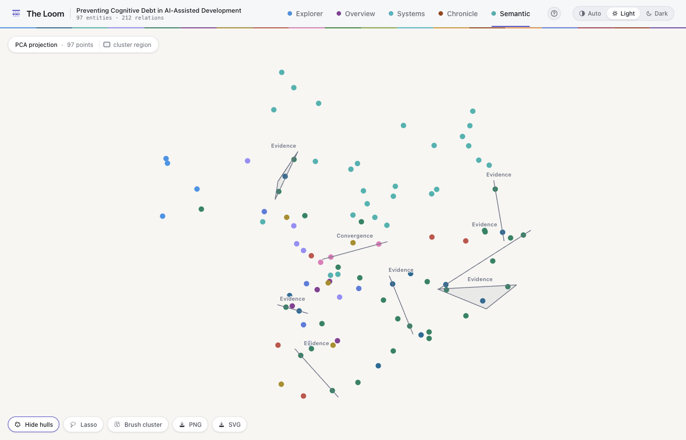

# The Loom

*Weaving knowledge into understanding.*

[](https://github.com/jpwinans/the-loom/actions/workflows/ci.yml)
[](LICENSE)
[](pyproject.toml)

A knowledge-graph substrate with a single JSON-in/JSON-out CLI, built on
**[FalkorDB](https://www.falkordb.com/)**. Entities, relations, entity vectors,
document chunks, and full-text all live in one transactional store. Every
mutation is an append-only event, so the current graph is a projection you can
query at any point in its history — *state as of time T* is a first-class
operation, not a reconstruction.



## Why The Loom

Agent memory systems solve recall: store what happened, retrieve what's
relevant. The Loom starts where recall stops. Every fact carries its evidence
(a confidence score, the basis for it, and where it came from), and when a
source weakens, everything built on it weakens too. The graph is something an
agent can *reason* over (causal chains, what-if simulation, weakest-link
analysis), and text generated from it is graded back against it. Recall is
the floor; a memory that can defend what it believes is the product.

## What it does

The CLI exposes **178 commands across 28 categories**, plus a special `init`
command and a set of high-level composites. In short:

- **Entities & relations** — full CRUD, bulk/batch import, typed relations, and
  a status lifecycle with validated transitions.
- **Graph analytics** — centrality, structural surveys, leverage points, loop
  and feedback analysis, path finding, and subgraph extraction.
- **Search** — semantic, full-text, and hybrid search over entity vectors, plus
  neighbor and cluster queries.
- **Epistemic layer** — provenance, confidence, credit assignment, reification,
  and epistemic queries ("what is stale?", "what is blocking?").
- **Calibration** — resolve a claim/hypothesis against reality and fold every
  resolution into per-author/basis/domain Brier scores and asserted-vs-empirical
  gaps, feeding back into new assertions (`CONFIDENCE_OUT_OF_LINE`) and
  propagate-credit's per-hop `dampingFactor: "calibrated"`.
- **Reasoning** — a semiring-composition engine with adaptive query routing,
  symbolic mathematics, verification, and inference.
- **Generative** — graph synthesis (plan → traverse → realize), entity and
  relation extraction, and document ingestion.
- **Composites** — one-call pipelines that chain the primitives: graph
  reconnaissance, entity deep-dive, influence maps, provenance audits,
  hypothesis generation, far-analogy retrieval, and autonomous creativity /
  self-improvement loops.

The full, always-current catalog is in **[COMMANDS.md](COMMANDS.md)** (generated
from the command registry).

## Requirements

- **Python ≥ 3.11**
- **[uv](https://docs.astral.sh/uv/)** for dependency management
- **Docker** (to run FalkorDB locally)

## Quickstart

```bash
uv sync                          # install dependencies into the venv
docker compose up -d falkordb    # start the store
uv run loom init                 # initialize the default graph
uv run loom --help               # list every command
```

Run a command by passing its name and a JSON payload:

```bash
uv run loom create-entity '{"name": "Ada Lovelace", "entityType": "person"}'
uv run loom graph-stats '{}'
uv run loom hybrid-search '{"query": "early computing", "limit": 5}'
```

### Example skills built on the Loom

The repository ships four [Claude Code](https://claude.com/claude-code) agent
skills that use the Loom as their substrate — worked examples of what the CLI
is for. The runnable assets live in `.claude/` (skills, workflows, agents,
schemas); the guides live in **[examples/](examples/README.md)**, one folder
per skill, each explaining how to use it and exactly how it drives the Loom:

| Command | What it does | Guide |
| --- | --- | --- |
| `/deep-research TOPIC` | Autonomous multi-iteration research building a graph of sources, evidence, and claims with calibrated confidence and provenance | [examples/deep-research](examples/deep-research/README.md) |
| `/hyper-research DOC` | Extracts independent questions from a document and runs deep-research per question in parallel onto one shared graph, then synthesizes across them | [examples/hyper-research](examples/hyper-research/README.md) |
| `/map-codebase PATH` | Explained architecture map of a repository — tree-sitter structure plus an LLM semantic layer, kept current by diff-scaled incremental updates | [examples/map-codebase](examples/map-codebase/README.md) |
| `/loom-expedition GRAPH` | Read-only discovery pass surfacing the emergent theories an accumulated graph implies — fast, synchronous, writes nothing | [examples/loom-expedition](examples/loom-expedition/README.md) |

Each skill launches its multi-agent workflow in the background and reports on
completion; the graph persists for follow-up queries. The map-codebase guide
doubles as this repo's own story: the committed `docs/architecture/` map is
the skill's output, run against The Loom itself.

## CLI contract

- **Input:** a single JSON argument per command; results print as JSON to stdout.
- **Schemas:** every command supports `--schema`, printing the JSON Schema of its
  input (fields, types, enums, defaults, and behavioral notes) — the canonical way
  to discover a payload shape without reading source.
- **Errors:** a typed error code plus message go to stderr and the process exits
  non-zero. Codes are `PARSE_ERROR`, `INPUT_REQUIRED`, `VALIDATION_ERROR`,
  `NOT_FOUND`, `OPERATION_ERROR`, and `CONFIG_ERROR`. Validation errors name the
  offending field and echo its expected schema fragment.
- **Honesty:** responses are facts or diagnoses, never silent no-ops. Structured
  `notices` (`{code, message, hint}`) flag anything that didn't happen or needs a
  follow-up (unpersisted results, ignored parameters, empty traversals with edge
  counts, auto-scoped verification), and dry-run-capable mutating commands carry
  `applied: true/false` reflecting what was actually written.
- **Docs:** `uv run loom --generate-docs` regenerates the command catalog from
  the registry.

## Visualization

`loom visualize` writes a self-contained, offline HTML file — a Graph
Explorer (sigma.js/WebGL, force-directed layout, search, filters, path
finding, a minimap) plus an Overview dashboard (composition, health,
confidence, most-central entities) — for any graph or scope. Nothing is
mocked or fetched at open time: the graph data is inlined into the page, so
it opens straight from disk with no server.

```bash
uv run loom visualize '{"graph": "tapestry-dev", "theme": "dark"}'
# -> loom-viz/tapestry-dev.html — open it in a browser
```

Scope the visualization to an entity's neighborhood instead of the whole
graph with `scope.mode: "ego"`:

```bash
uv run loom visualize '{
  "graph": "tapestry-dev",
  "scope": {"mode": "ego", "center": "<entity-id>", "depth": 2},
  "output": "population.html"
}'
```

`scope.mode` also accepts `causal` (causal-relation subgraph only), `typed`
(filter by `entityType`/`relationType`), and `search` — embed a `query`,
keep the entities it matches (plus the relations induced among them), and
label the scope `search:<query>`:

```bash
uv run loom visualize '{
  "graph": "tapestry-dev",
  "scope": {"mode": "search", "query": "training neural networks with gradient descent"}
}'
# -> a bundle scoped to the 3 matching "gradient descent" concepts, nothing else
```

`scope.mode: "search"` reuses the same similarity search the `semantic-search`
command runs, with a relevance floor tuned for genuine topical matches rather
than near-duplicate text — a query needs real semantic overlap with an
entity's stored text to match, so an unrelated query returns an empty scope
rather than an error. It always searches the graph's *current* embeddings
regardless of `asOf` (see below). `include` toggles the `analytics`,
`temporal`, and `semantic` sections independently, and `export-bundle`
returns the same assembled JSON without writing HTML, for piping into other
tooling.

The screenshots below all show one real graph — a `/deep-research` run on
preventing cognitive debt in AI-assisted development: 97 entities across ten
types (sources, evidence, claims, hypotheses, tensions, convergences) joined
by 212 relations, 70 of them `supports` and 41 `contradicts`.


The Overview dashboard summarizes the same bundle — composition by entity and
relation type, graph health (contradictions, dangling relations, unscored
entities), and a confidence histogram:



Three more tabs read the same bundle as a systems-dynamics model, a history,
and an embedding space, rather than a knowledge graph:

- **Systems** draws the causal-only subgraph as a causal-loop diagram: every
  edge carries a `+`/`−` polarity glyph (amplifies/inhibits — never color
  alone), the right rail lists every reinforcing/balancing feedback loop from
  `analytics.loops`, and clicking one isolates it on the canvas. "Animate
  flow" then sends a signed pulse traveling the isolated loop in its
  influence direction, and any variable carrying a Meadows leverage point
  (`analytics.leveragePoints`) wears a numbered badge for its leverage level.
- **Chronicle** replays the graph's construction from `temporal.events`: drag
  the scrubber (or press play) to watch entities and relations appear in the
  order they were created, with a status change — a deprecation, say —
  visibly restyling the affected node the instant it happens. **Diff mode**
  anchors one instant and compares it against another, color-coding what
  changed between them as added, changed, or invalidated.
- **Semantic Map** scatters `semantic.projection` — a 2D layout of entity
  embedding vectors, colored by entity type — with no force layout: the
  projection *is* the layout, so it mounts instantly. Labeled hulls wrap each
  group `find-clusters` reports (never color-alone — every hull carries its
  dominant entity type as a label), toggleable independently, and a freehand
  lasso brushes a set of points that carries into the Explorer as a
  highlighted selection with a count chip. The projection is **PCA** by
  default (numpy SVD, always available); installing the optional
  `uv sync --extra viz-umap` extra upgrades it to a seeded, deterministic
  **UMAP** embedding once a graph has enough vectors (10+) — `semantic.method`
  reports which ran. Neither the projection nor the clusters are bounded by
  `asOf`: both reflect the graph's *current* embeddings.

In every graph view — Explorer, Systems, Chronicle, and the Semantic Map —
nodes are draggable: press and hold one to reposition it, Obsidian-style, and
its edges follow while it stays where you drop it (in the Explorer and Systems
the force layout pauses for the drag and resumes only if it was running).


The Systems shot uses a companion causal model distilled from the same
research — ten variables and fourteen signed edges, in which the loop
detector finds one reinforcing and four balancing loops.





Every view — Explorer, Overview, Systems, Chronicle, and the Semantic Map
alike — can also be bounded to a moment in the graph's own history with the
bi-temporal `asOf` parameter, which asks the store for the graph as it stood
at that instant — each entity in the incarnation current then, every relation
whose validity interval was open then (including edges retired since), and the
event log truncated to it (the Semantic Map's projection and clusters are the
one exception: as noted above, they always reflect current embeddings, never
`asOf`):

```bash
uv run loom export-bundle '{"graph": "tapestry-dev", "asOf": "2026-07-11T18:00:00Z"}'
# -> the bundle as it stood at that instant: fewer entities, fewer relations,
#    a truncated temporal.events, and meta.asOf echoing the bound
```

### Saved views

The Explorer's Views menu bookmarks the current deep-link hash as a named,
per-graph view in `localStorage` — save, rename, delete, and reapply without
leaving the page. **Export views** downloads a graph's saved views as a
portable `<graph>-views-<date>.json` file; **Import views** merges another
file's entries back in (last-write-wins by name, never throws on a malformed
file). Opening the page at `…#view=<name>` resolves that name against the
current graph's saved views and applies it immediately, rewriting the URL to
the view's own `#s=` hash — so a `#view=` link is a stable, shareable pointer
to a named view even as the view's underlying state hash evolves.

### Accessibility & keyboard

Every control is keyboard-operable, and the SPA carries a clean
`@axe-core/playwright` audit (zero serious/critical violations) across all
five views in both light and dark themes. The header's tab bar and theme
switcher are composite widgets (`role="tablist"` / `role="radiogroup"`):
arrow keys plus Home/End move focus and selection within each, per the
WAI-ARIA pattern, and every interactive element carries a visible focus ring
in both themes. A polite `aria-live` region announces graph switches and
live-mode refreshes. Press **`?`** (or click the header's `?` button) for a
focus-trapped help overlay listing every shortcut by scope — `/` search, `p`
path mode, `f` fit, arrow-key neighbour walk, and `Esc` clear in the
Explorer; scrubber arrows and Space to play/pause in Chronicle; Enter to
isolate a loop or toggle flow in Systems; Enter to brush a cluster in the
Semantic Map — and `Escape` closes it, returning focus to whichever control
opened it. The Semantic Map's lasso is the one pointer-only canvas action;
its keyboard equivalent is a cluster-brush list that performs the same
brush-then-"View in Explorer" flow.

### Exports

Every view exports what's actually on screen. The Explorer, Systems,
Chronicle, and Semantic Map each offer a **PNG** (a WYSIWYG flatten of
Sigma's own canvas layers, pre-filled with the current theme's canvas colour
so it isn't transparent) and an **SVG** (the same visible nodes and edges
redrawn as vector marks, with an optional legend — polarity glyphs, status
colours, a cluster's projection method — for whatever the view normally
shows as an HTML/SVG overlay and so can't appear in the flattened PNG or the
marks-only SVG itself). Every export is named `<graph>-<view>-<date>.<ext>`.
The Overview dashboard is DOM, not canvas, so its WYSIWYG path is a **Print**
button and a dedicated print stylesheet — Save-as-PDF from the browser's
print dialog.

### Scale

Bundle assembly is hardened for 50k nodes / 100k edges. An optional
`maxEntities` input (on both `export-bundle` and `visualize`) caps the
shipped entity/relation set to the top-`maxEntities` core by degree — a
fast, deterministic O(E) ranking, not a centrality call — and records
`meta.truncated: {total, kept, by: "degree"}` whenever the cap actually
fires (omitted otherwise):

```bash
uv run loom export-bundle '{"graph": "tapestry-dev", "maxEntities": 2}'
# -> entityCount capped to 2 and meta.truncated reports the pre-cap total,
#    e.g. {"total": 4, "kept": 2, "by": "degree"} on a small dev graph
```

Analytics has its own, independent guardrails so the two super-linear
analyses can't dominate a huge graph: betweenness centrality (O(V·E)) is
omitted above 5,000 nodes (`degree`/`pagerank` still ship); loop enumeration
is skipped entirely above 10,000 nodes and otherwise capped to loops of at
most 12 edges; every centrality algorithm ships at most 1,000 scores. On the
frontend, ForceAtlas2 switches to explicit Barnes-Hut approximation
(`barnesHutTheta` 0.6) above 3,000 nodes, every Sigma view thins labels to
only the highest-degree nodes (`labelRenderedSizeThreshold` 14) above 2,000
nodes, Explorer hover effects are suppressed while the layout is still
running, and the Chronicle's event list virtualizes its rows above 200
events — only the visible window (plus overscan) is ever mounted, however
many events the graph has.

Measured once on a synthetic 50,000-entity / 100,000-relation graph built by
`scripts/gen_bench_graph.py` (the benchmark runs locally, never in CI):
bundle assembly with analytics on (guardrails active) took 23.7 s, or
6.6 s with `{"include": {"analytics": false}}`; the bundle JSON is ~46.8 MB;
the SPA's initial render (parse → build graph → first paint) on that bundle
took 31.75 s, after which interaction ran at a steady 120 fps with the
layout frozen. Both numbers exceed their original aspirational
targets at this scale — centrality dominates assembly, inline-bundle
parsing and Louvain clustering dominate first paint — so the practical
fast-load path at 50k+ is the `maxEntities` cap above. Full methodology and
the measured-vs-target table are recorded in
[`docs/benchmarks/tapestry-scale.md`](docs/benchmarks/tapestry-scale.md).

### Live mode: `loom serve`

`loom serve` serves the *same* single-file Tapestry SPA against the live
store over a read-only REST API — no rebuild, no separate frontend, and no
new store. It reuses the exact assemblers `visualize`/`export-bundle` already
ship (`assemble_bundle`, `resolve_scope`, `semantic_search`,
`store.read_entity`), so a live client and the CLI always agree. FastAPI and
uvicorn are an **optional** `viz-serve` extra — the core install is
unaffected whether or not it's present.

```bash
uv sync --extra viz-serve   # or: pip install 'theloom[viz-serve]'
uv run loom serve '{"graph": "tapestry-dev", "host": "127.0.0.1", "port": 8100}'
# -> {
#      "host": "127.0.0.1",
#      "port": 8100,
#      "url": "http://127.0.0.1:8100",
#      "graph": "tapestry-dev"
#    }
# open http://127.0.0.1:8100
```

`serve` prints that handshake line, then blocks until Ctrl-C.

| Endpoint | Description |
| --- | --- |
| `GET /` | The live Tapestry SPA — the committed template with its data sentinel swapped, per request, for a `{"live": true, "apiBase": "/api"}` marker. |
| `GET /api/graphs` | The registered graphs: `[{"name": ..., "loaded": false}, ...]`. |
| `GET /api/bundle` | The same bundle `export-bundle` builds. Query params mirror it: `graph`; `mode`/`center`/`depth`/`entityType`/`relationType`/`query` (scope); `analytics`/`temporal`/`semantic` (include toggles); `asOf`; `title`. |
| `GET /api/as-of?asOf=` | A thin alias for `/api/bundle` that requires `asOf` (422 without it) — the time-travel affordance as its own named endpoint. |
| `GET /api/neighbors?id=&depth=` | The ego subgraph around one entity (Phase 5 wires the Explorer's double-click expand to this). |
| `GET /api/search?q=&limit=` | Semantic search hits via the same path `loom semantic-search` runs, so live search agrees with the CLI. |
| `GET /api/entity/{id}` | The full wire entity document. |

The server is **read-only** — nothing it exposes mutates the graph. Typed
`LoomError` codes map to HTTP status through one handler
(`NOT_FOUND` → 404, `VALIDATION_ERROR` → 422, everything else → 400/500),
never by matching error text.

In live mode the header grows a small "Live" indicator, a graph switcher
(shown once more than one graph is registered) that re-fetches `/api/bundle`
for the selected graph, and a refresh button that re-fetches the current one.
The static export (`loom visualize`) and live mode ship the same committed
frontend — the served page detects which mode it's in from how its inlined
data block parses, not from a separate build.

## Layout

```
theloom/        the package
  model.py        Pydantic domain model (single source of truth)
  config.py       configuration
  errors.py       typed error codes
  cli/            Typer CLI (io, app, command registry, docs)
  store/          FalkorDB store, event log, lifecycle, filters, migration
  graph/  semantic/  algebra/  synthesis/  analysis/  exploration/
  documents/  extraction/  verification/  operations/  composites/
  reification/  symbolic/  prompts/
  viz/            TapestryBundle assembly + HTML template injection
tests/          test suite, including golden fixtures and harness
tapestry/       frontend workspace (Vite/React/sigma.js SPA, contributor-only)
examples/       per-skill guides: how each shipped skill drives the Loom
docs/
  architecture/   the self-model: generated map, query cheat-sheet, manifest
  adr/            architecture decision records
  benchmarks/     recorded scale benchmarks
  design/         approved design specs
scripts/        dev utilities (benchmark graph generator, live-demo seeder)
CONTEXT.md      the ubiquitous language — domain glossary
STACK.md        the dependency stack, and why each library
docker-compose.yml   FalkorDB service
pyproject.toml       project + tooling config (ruff, mypy, pytest)
```

The repository maps itself: **[docs/architecture/ARCHITECTURE-MAP.md](docs/architecture/ARCHITECTURE-MAP.md)**
is the generated, explained map of this codebase, kept current after merges by
[`/map-codebase`](examples/map-codebase/README.md), and
**[docs/architecture/QUERYING.md](docs/architecture/QUERYING.md)** is the cheat
sheet for querying the underlying graph instead of grepping.

## Development

```bash
uv run pytest                    # tests
uv run ruff check . && uv run ruff format .
uv run mypy --strict theloom
```

See **[CONTRIBUTING.md](CONTRIBUTING.md)** for the full quality gate, the
architecture invariants every change must respect, and the PR workflow.

## License

[ISC](LICENSE). Note that FalkorDB's server is SSPLv1 (source-available) —
fine for running The Loom locally or internally; see the license note in
[STACK.md](STACK.md) if you intend to offer FalkorDB itself as a hosted
service.
